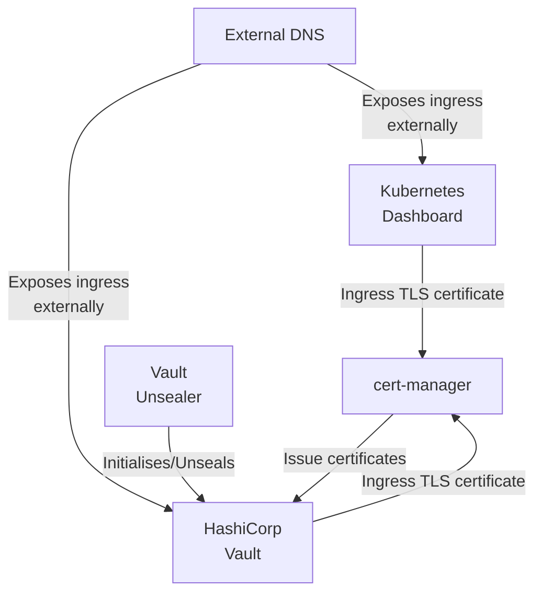

# Kubernetes Example

## :link: Table of Contents

* [:link: Table of Contents](#link-table-of-contents)
* [:grey\_question: Why](#greyquestion-why)
* [:warning: Disclaimer](#warning-disclaimer)
* [:receipt: Prerequisites](#receipt-prerequisites)
* [:computer: Installation](#computer-installation)
* [:gear: Usage](#gear-usage)
* [:raising\_hand\_man: Support \& Assistance](#raisinghandman-support--assistance)
* [:handshake: Contributing](#handshake-contributing)
* [:clipboard: References](#clipboard-references)
* [:wave: Acknowledgements](#wave-acknowledgements)
* [:balance\_scale: License](#balancescale-license)

## :grey_question: Why

After some searching on the internet, I wasn't able to find a complete
Kubernetes installation tutorial that included all the features I wanted for my
home cluster. I've collected bits and pieces of multiples sources and combined
them into a single cluster setup example. This repository is the result of my
research, trial and error and personal preferences.

Here's a rough relationship diagram that demonstrates each component's
high-level purpose.

## :warning: Disclaimer

This cluster configuration example is not meant to be used in production. While
it can be used as a starting point, there are several changes required to make
it stable and secure and these are outside the scope of this project.

## :receipt: Prerequisites

To implement this cluster example as-is, you'll need:

* [K3s' requirements](https://docs.k3s.io/installation/requirements)
* Helm (was tested with version `v3.11.1`)
* Terraform (was tested with version `v1.3.9`)
* iSCSI target(s) for remote storage
* `open-iscsi` needs to be installed on all nodes

## :computer: Installation

All cluster components are managed with Helm charts and can be installed mostly
independently. For detailed installation instructions, please see the related
[document](./Installation.md)

## :gear: Usage

Cluster access is documented [here](https://docs.k3s.io/cluster-access).

By default these services are exposed outside the cluster:

* HashiCorp Vault (`https://vault.domain.local`)
* Kubernetes Dashboard (`https://k8s-dashboard.domain.local`)

## :raising_hand_man: Support & Assistance

* :heart: Please review the [Code of Conduct](.github/CODE_OF_CONDUCT.md) for
     guidelines on ensuring everyone has the best experience interacting with
     the community.
* :raising_hand_man: Take a look at the [support](.github/SUPPORT.md) document
     on guidelines for tips on how to ask the right questions.
* :lady_beetle: For all features/bugs/issues/questions/etc, [head over
  here](https://github.com/Bibz87/kubernetes-example/issues/new/choose).

## :handshake: Contributing

* :heart: Please review the [Code of Conduct](.github/CODE_OF_CONDUCT.md) for
     guidelines on ensuring everyone has the best experience interacting with
    the community.
* :clipboard: Please review the [contributing](.github/CONTRIBUTING.md) doc for
     submitting issues/a guide on submitting pull requests and helping out.

## :clipboard: References

* [Building a bare-metal Kubernetes cluster on Raspberry
  Pi](https://anthonynsimon.com/blog/kubernetes-cluster-raspberry-pi/)
* [k3s on Raspberry Pi:
  Introduction](https://blog.differentpla.net/blog/2020/02/06/k3s-raspi-intro/)
* [K3s DNS Setup](https://trenta3.gitlab.io/note:k3s-dns-setup/)
* [Vault using Kubernetes
  auth](https://ddymko.medium.com/vault-using-kubernetes-auth-c67cfcdc8d6e)
* [External DNS](https://trenta3.gitlab.io/note:k3s-dns-setup)
* [Kubernetes
  Dashboard](https://kubernetes.io/docs/tasks/access-application-cluster/web-ui-dashboard)
* [cert-manager](https://cert-manager.io)
* [HashiCorp Vault](https://www.vaultproject.io/)
* [Vault Unsealer](https://github.com/pyToshka/vault-autounseal)

## :wave: Acknowledgements

Huge thanks to [@lrstanley](https://github.com/lrstanley) for letting me use his repository documentation
templates!

## :balance_scale: License

This work is licensed under a [Creative Commons Attribution-NonCommercial 4.0
International License](http://creativecommons.org/licenses/by-nc/4.0/).

_Also located [here](LICENSE)_
